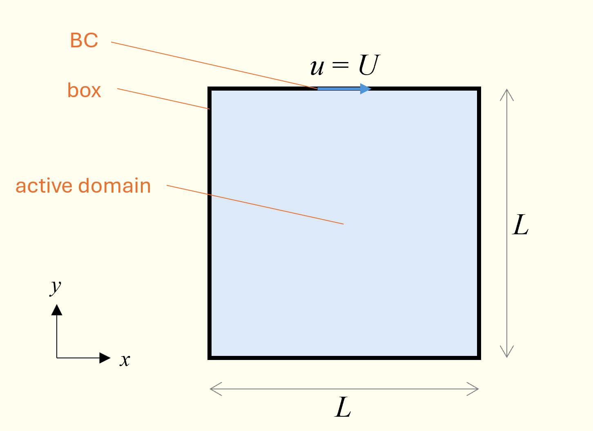

# Lid-driven Cavity

## Description
We will start with the lid-driven cavity. This is not an ideal problem for MFIX-Exa because
the code *a*) does not support moving boundaries, *b*) does not have a robust
steady-state solver, and *c*) does not support 2-D domains. The lid-driven cavity is not
the most ideal problem for any code because there are singularities at the top corners[^1]
which are multi-valued, but it is a classic CFD benchmark problem used in the tutorials of
many codes. A sketch of the problem is given below:
[^1]: There are singularities at all four corners TODO (hopefully recover that HD otherwise re-write what those corner singularities are).



The case is defined by just one dimensionless group, the Reynolds number:
```math
Re = \frac{\rho_f U L}{\mu_f}
```
where $\rho_f$ and $\mu_f$ are the fluid density and material viscosity, $L$ is the length of
the square cavity, and $U$ is the velocity of the lid, i.e., the "top" boundary condition (BC).
To start, we'll target a Reynolds number of $Re = 100$. In the [inputs](./run/inputs) provided,
I have (arbitrarily) selected $\rho_f = 1000$ kg/m<sup>3</sup>, $U = 1$ m/s, $L = 0.1$ m
and $\mu_f = 0.001$ Pa-s.

> [!NOTE]
> MFIX-Exa only uses the SI unit system.

The cavity size is specified in two locations. First, the domain is set to length (in $x$ and $y$)
with the amrex `geometry.` keywords:
```
geometry.coord_sys   = 0                     # 0: Cartesian
geometry.is_periodic = 0      0      1       # Is periodic in each direction?
geometry.prob_lo     = 0.     0.     0.      # lo corner of physical domain
geometry.prob_hi     = 0.1    0.1    0.025   # hi corner of physical domain
```
I've set the out-of-plane ($z$) dimension to have a length of $L/4$ and the domain is
made periodic in that direction. Additionally, we need to define an embedded boundary (EB)
on which the BCs are defined. In this case, the simplest thing to use to use is an amrex-native `box` EB:
```
mfix.geometry = box

box.Lo = 0.0  0.0  -0.1
box.Hi = 0.1  0.1   0.2

box.offset = 1.0e-12
```

> [!NOTE]
> Note that the length of the box is much longer than the domain in the periodic direction.

The `box.offset` tells amrex how much to move the EB into the domain so that it's not
accidentally rounded outside of the domain. The fluid viscosity is set to a single constant
value for the entire simulation by setting:
```
fluid.viscosity.molecular.constant = 1.0e-3
```
The density is set in initial condition (IC) and BC regions. Here there is only one IC region, `full-domain`
which sets a density of
```
ic.full-domain.fluid.density   =  1.0
```
By default, EBs are treated as no-slip walls (NSWs).


WIP

lid-driven cavity -- give it out so it doesn't work. first, show that the p0 from initial projection is expected 9.87...e+32. that's an identifier for developers, I.e., to easily identify if an initial pressure isn't applied somewhere. so that one's fine. but in the next line, step 1 we see velocities of order +32 as well. this is not ok. the solution has diverged before it has even begun. the problem is that the initial iterations don't see the boundary velocity and take the largest possible step, 1.+14 which, as soon as fluid motion is felt diverges instantly. There are several ways to deal with this, we will cover two methods below.
First, as mentioned, the problem is that a too large time step is taken. We could reduce the time step of the initial iterations by a user supplied factor keyword but this feature was developed to scale dt by 2 or 3, maybe 10, not 10^17. It's easier to control the actual simulation time step. even though this is a steady state problem, we still have access to limit dt through the mfix.dt_max keyword. so first, remove the initial iterations by setting mfix.initial_iterations = 0  in the inputs (note to self, this should already be in the inputs and set to 3). let's go ahead and run this now. you see that initial iterations are skipped, we get into the pseudo-time advancement and again diverge right away, again because we start with a dt of 1e+14 and just can't recover as soon as the eb BC affects the fluid. so now let's limit the max dt so we don't start with such a ridiculous first step. I'm going to use mfix.dt_max = 0.001 . now your case should run.
A second method is to key the time stepping algorithm in on the fact that we expect velocities on the order of 1m/s in the domain. Instead of using a single full-domain homogeneous IC, let's add a second, small IC close to the wall that has $u$ = 1 m/s. first we need to add this new IC to the regions list, let's call it
## post processing
### visualizing
Paraview to see u and v contours
### analysis
fextract & compare to ghia ghia & shen
## higher reynolds number
decreasing viscosity. can you increase u and get the same result?
## resolution
--- increase to to 64^2
--- parallel, set the grid to 32 x 32 and run on 4 CPUs
--- increase to 128^2
--- base 2 grids
As you know, MFIX-Exa uses AMReX under the hood. Even though we rarely use AMR capabilities, AMReX (and MFIX-Exa by extension) is a multi-level, multigrid block-structured AMR framework. The MLMG Algo has a strong preference for nice power-of-two grids. so if we want an odd number to truly get centerline data, rather than setting n_cells to 129, let's keep n_cells = 128 128 32 and either shrink the box or grow the domain. In this case, i'll choose to grow the domain, (oof this is going to be an ugly number) (edited)


wdf - This is the diff from the file I was running from what's in your
mfix-exa-stuff repo plus the first change to get it to run.

14c14
< amr.blocking_factor = 4
---
> amr.blocking_factor = 16
29d28
< #amr.n_cell =  32  32  8
104c103
< mfix.regions = full-domain  top-wall  near-wall
---
> mfix.regions = full-domain  top-wall
112,114d110
< regions.near-wall.lo    =  0.0125   0.0875  0.0
< regions.near-wall.hi    =  0.0875   0.1     0.025
<
120c116
< ic.regions = full-domain  near-wall
---
> ic.regions = full-domain
127c123
< ic.full-domain.fluid.pressure  =  0.0
---
> ic.full-domain.fluid.pressure  = 101.325e+3
129,133d124
<
< ic.near-wall.fluid.volfrac   =  1.0
< ic.near-wall.fluid.density   =  1.0
< ic.near-wall.fluid.pressure  =  0.0
< ic.near-wall.fluid.velocity  =  1.0  0.0  0.0
